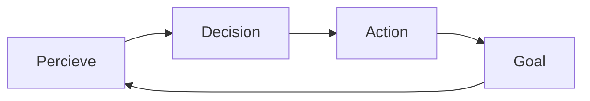

Google shacked the industry (again) with their A2A protocol, this is what you need to know
<!-- more -->
> We can say A2A is a standard way to communicate between agents. It ensures collaboration. Authentication, Communication. Why? Because they can that's why? How? Start reading.

In the single agent system, you most likely see the following workflow:

## Core of A2A

## A2A Simple Workflow

## Multi Agent Workflow Using A2A
