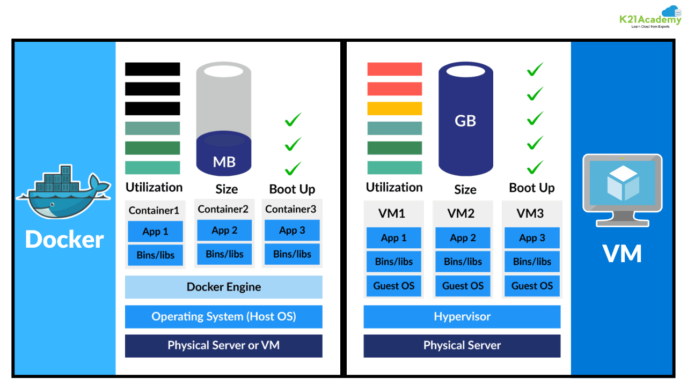

If you are a curious developer, you need docker. Let's see why and how it works 🚀⚡

<!-- more -->

## What is Docker?
Who care about the defination anymore? Let's point out when and why you need it.
- Your application dependents on different services like databases, libraries, frameworks and each of them have their own dependencies and versions (say you framework depends on python 3.10). You decided that your application v1 will run on database v1.0, library v1.5 and framework v3.10. Others who needs to run your application will need to install the same dependencies and versions. They also want to run another application that depends on python 3.12 - Now what?
- Say you need a library that now requires at least python 3.11 - now what?
- Your application is working on your windows machine, but your server is running on linux - now what?
- You are working on a RnD ticket and with the same machine you need to test different version of the same library or framework - now what?
- You are the developer and the Ops team is managing the operation of your application. Each time you need a configuration change, your ops team now need to know the details - now what?

Well, now is "Docker"

## What is Container
Let now pack each of the service in a "Container". Set up a network to communicate with the containers. When creating a containers you are defining the dependencies and versions only for the service it will run. Others containers do not care about it. They will run on docker which will run on OS.
- Now, need different python version for different application? Just run them on two different containers.
- Now, only one service needs updated python version? Just update the container and restart it.
- Now, need to run the application on linux server? Make a container, run on docker, we don't give a damn about the OS anymore.
- Now, you need to test different version of the same library or framework? Just create as many containers as you need.
- Now, just give an image to your OPs team, they will take care of the rest.

!!! info
  Each container have their own **libs**, **deps**, **processes**, **mounts**, and **network**

## What is the difference between Container and VM?
Just see the diagram, it's self explanatory.


## What is Images
If you have a plan of making dummy robot, the plan have the details of all the components and how they are assembled - that plan is used to create dummy robot at any time, any amount. Well, in docker realm the plan is called "Image" and each dummy robots is called a "Container".
Docker Hub is full of this images, you can use them to create your own containers. In case you don't find what you need, you can build your own image. You can keep/publish it anywhere you want and share it with anyone you like. Sounds like making "Container" and "Shipping" them where it's needed.

## Container Port Mapping
Your service is running on Docker Host, Docker Host is running on the machine, the end user is also interacting with the machine - not with the service. So how end user is going to communicate with the service? 
You need to map the port of your service to a docker host port. Docker will communicate with the host port with user, and use the service port to communicate with the service running in the container.
```docker run -d --name friendly_name -p host_port:container_port container_name```
In docker run command we use `-p` flag and `host_port:container_port` for mapping the port of the host and container.

## Container Volume Mapping
You created a service that needs a volume to store some output and use them later. But when you run a container the service creates the volume in the container, stores data, and re-uses the data if necessary. But that volume gets destroyed when the container gets destroyed. To retain the data and reuse it later with other containers or different version of same service containers, we need to create a separate volume out of the container, in local machine and map that volume to the container volume.
```docker run -d --name friendly_name -v host_path:container_path container_name```
In docker run command we use `-v` flag and `host_path:container_path` for mapping the volume of the host and container.

## Docker Image
For creating a docker image, first you need to decide what exactly you need. Docker images consists of layers, each layer is a new instruction in the Dockerfile. 

### Docker Build

Docker Build = Client + Server = `Buildx` CLI tool + `BuildKit`

`Buildx` can create BuildKit, manage images in registry, run multiple builder concurrently.

`BuildKit` is the demon process that do the build work. Buildx -> Build Request(`dockerfile`, `build arguments`, `Export Options`, `Caching Options`)


### Dockerfile
Name of the file: `Dockerfile`
Extension: None
Instructions: `Instructions` and `Arguments`.

The instructions of the Dockerfile executed in layer by layer manner, each line creates a new layer on the previous layer.

!!! info
    In case you have multiple Dockerfile, a better practice is to use the `<something>.Dockerfile` naming convention. Use `--file` flag in the `docker build` command to specify the Dockerfile.

```shell
# syntax=docker/dockerfile:1
FROM ubuntu:22.04

# install app dependencies
RUN apt-get update && apt-get install -y python3 python3-pip
RUN pip install flask==3.0.*

# install app
COPY hello.py /

# final configuration
ENV FLASK_APP=hello
EXPOSE 8000
CMD ["flask", "run", "--host", "0.0.0.0", "--port", "8000"]
```
- *Docker Syntax*:`syntax=docker/dockerfile:1`: Says the BuildKit which syntax to use when parsing the Dockerfile.
- *Base Image*: `name:tag`
- *Environment Setup*: `RUN` inatrustions with `<commands>`
- *Comment*: `#` Comments
- *Installing Dependencies*: `RUN` instructions with `<commands>`
- *Copying Files*: `COPY` instructions with `<source>` and `<destination>`. The set of files we use in `ADD` and `COPY` are called `build context`.
- *Setting Environment Variables*: `ENV` 
- *Exposing Ports*: `EXPOSE`
- *Running Commands*: `CMD`
exec form -> [`<"command_1">`, `<"command_2">`, ... ,`<"args">`]
shell form -> `<command_1> <command_2> ... <args>`

Command to build: `docker build -t <image_name:tag> <context>`. `.` represent the current directory as the `build context`. `Build Context`can be a relative/absolute path, remote URL of Git Repo. tarball, plain-text file. All subdirectory or submodules are included. 
`docker build https://github.com/user/myrepo.git#container:docker`is an example of remote URL of Git Repo as the `build context`. You can use `--ssh` and `--secret` flags for private repo. You can use `.dockerignore` file to exclude files from the `build context`. 


### Docker File Instruction References


- `FROM <image>`:
- `RUN <command>`:
- `WORKDIR <directory>`:
- `COPY <source> <destination>`:
- `CMD <command>`:
- 

## Docker Compose
In case your application have different services and each services need some configurations, you will need `docker-compose.yml` file. It's just a YAML file that outlines the services, how they are related, how they are configured, what images they have etc. In one word, it's a tool to make your life easier in case of complex, confusing multi-container applications.

`docker compose up` => Starts the services defined in the `docker-compose.yml` file.
`docker compose down` => Stops the services defined in the `docker-compose.yml` file.

But remember, all the services are running on a single docker host.

### docker-compose.yml
It will be a dictionary of services, each service has its own configuration.
```yaml
version: "3"
include:
  - other_docker_compose_file.yml
  - another_docker_compose_file.yml
  - yet_another_docker_compose_file.yml
services:
  service_name_key:
    image: <image_name>
    ports:
    - <host_port>:<container_port>
    volumes:
    - <host_path>:<container_path>
    networks:
    - <network_name>
    develop:
      watch:
      - action: sync
      - path: ./service_directory
      - target: /app
    post_start:
    - command: <command>
      user: root
    pre_stop:
    - command: <command>
    environment:
    - <KEY>=<value>
    - <ONLY_KEY>
  another_service_name_key:
    build: ./another_service_directory
    ports:
    - <host_port>:<container_port>
    - <host_port2>:<container_port2>
    volumes:
    - <host_path>:<container_path>
    environment:
    - <environment_variable1>=<value1>
    - <environment_variable2>=<value2>
    networks:
    - <another_network_name>
    depends_on:
      service_name_key:
        condition: service_started
    profiles: [development]
  most_simple_service_name_key:
    image: <image_name>
    ports:
    - <host_port>:<container_port>
    networks:
    - <network_name>
    - env_file: "<path_to_env_file.env>"
    healthcheck:
      test: ["CMD", "curl", "-f", "http://localhost:<container_port>"]
      interval: 30s
      timeout: 10s
      retries: 3
      start_period: 40s
      
networks:
- <network_name>
- <another_network_name>
  
```
Here are the explanations for everything we did in the `docker-compose.yml` file.
- `service_name_key`: The name of the service.
- `image`: The image to use for the service. Name used in here will be used to pull the image from the registry.
- `ports`: The ports to map to the host.
- `volumes`: The volumes to map to the container.
- `environment`: The environment variables to set in the container.
- `build`: If we do not have the image in the registry, here we specify the directory of the source code and the Dockerfile of that service. Docker will build the image from the Dockerfile and use it for the service.
- `depends_on`: Controls the order of service startup and shutdowns. Order `depends_on` -> `links` -> `volume_from` - `network_mode:..`. It have `condition` key and that can take `service_started`, `service_healthy`, `service_completed_successfully` values. `service_healthy` also have a dependency check called `healthcheck`. `service_completed_successfully` make sure the successful run.
- `develop`: If we want to develop the service, we can use the `develop` key to mount the source code to the container.
- `watch`: In develop mode, we can use the `watch` key to watch the changes in the source code and rebuild the image automatically. `watch` have `action`, `path`, `target`keys.
    - `action`: The action to perform when the change is detected. `sync` to sync the changes to the container. `restart` to restart the container.
    - `path`: The path to watch the changes.
    - `target`: Target holds the path of docker container, whenever a file change is changed - it sync in the target.
- `post_start`: The commands to run after the service starts.
- `pre_stop`: The commands to run before the service stops.
- `env_file`: The environment file to load the environment variables from.


- `include`: If we want to include other docker-compose.yml file, we can use the `include` key. It adds maintainability and readability to the file.

!!! info
    To start a container in watch mode, we need to use `docker compose up --watch` command. To start a container under dedicated profile use `docker compose up --profile <profile_name>`. For multiple profile use multiple `--profile` flags.

!!! info
    You can only mention the `KEY_NAME` in the compose file and pass the value from the shell. `docker run -e VARIABLE ...`


#### Real life example of docker-compose.yml
Say you need to develop an application. Here are the services and requirements. We name it "Voting App".
1. Vote UI - A react web app that take vote from the user.
2. Redis - A in memory database to store the votes from UI.
3. Worker - A .Net application to read votes from redis and process the vote.
4. Postgres - A persistent database to store the votes and results.
5. Result UI - A node.js web app to display the results of the votes.

Let's create a docker-compose.yml file for this application.

```yaml title="docker-compose.yml" linenums="1"
version: "3"
services:
  redis:
    image: redis:latest
  db:
    image: postgres:9.4
    environment:
    - POSTGRES_USER=postgres
    - POSTGRES_PASSWORD=postgres
    - POSTGRES_DB=postgres
  vote:
    build: ./vote

    ports:
    - 8080:8080
    depends_on:
    - redis
  worker:
    image: worker-app:latest
    depends_on:
    - redis
    - db
  result:
    image: result-app:latest
    ports:
    - 8081:8081
    depends_on:
    - db

```

#### Instructions:
> `FROM`: The starting point of an image. Mostly it's a OS or other base image.
```FROM <base_image_name>[:tag] [AS <alias>]```
Example:
```FROM ubuntu``` => Uses the ubuntu image as the base image.
```FROM ubuntu:20.04``` => Uses the ubuntu image with tag 20.04 as the base image.
```FROM ubuntu:20.04 AS my_ubuntu``` => Uses the ubuntu image with tag 20.04 as the base image and aliases it as my_ubuntu.

> `RUN`: Runs a particular command on the base image and during image building process. If we need to run multiple commands, we can use multiple `RUN` instructions.
```RUN <command>```
Example:
```RUN apt-get update && apt-get install -y python3 python3-pip``` => Updates the package list and installs python3 and python3-pip.
!!! warning
    Try to maintain Layer optimization. Each `RUN` creates a different layer. If you can combine multiple commands into one `RUN` command, it will create a single layer. For large or complex command you can make it multiline with `&& \` at the end of each line. 
  

> `COPY`: Copy files from host to container. 
You can have different files and directories in your project. You can copy them to the container.
```COPY [--chown=<user>:<group>] <source> <destination>```
Example:
If `requirements.txt` is in the root of the project, also where we have the Dockerfile
```COPY requirements.txt .``` => Copies the requirements.txt file to the root of the container.
```COPY requirements.txt /app/requirements.txt``` => Copies the requirements.txt file to the /app directory of the container.
```COPY . .``` => Copies all the files and directories to the root of the container.
`--chown=<user>:<group>`: Changes the owner and group of the copied files.
`<source>`: The source file or directory.
`<destination>`: The destination directory.

> `ENTRYPOINT`: Command that always will be executed when the container starts. If additional instruction is passed with the `run` command - those instructions will be appended to the `ENTRYPOINT` command.

> `EXPOSE`: 

  > `CMD`: Command that will be executed when the container starts. If `ENTRYPOINT` is present, `CMD` will be used as the default argument. If additional instruction is passed with the `run` command - those instructions will override the `CMD` command.


## Commands References
> ```run``` Runs a container from an image.

```docker run <image_name> <optional_commands>```
Here, <image_name> is the name of the image you want to run. <optional_commands> are the commands you want to run inside the container.
Example: 
```docker run nginx``` => Runs a container from the nginx image.
`-d` : Runs in detach mode.
`--name`: Gives the container a user friendly name.
`-p host:container`: Maps the port of the host and container. Outside word will communicate with host post, docker host will communicate with the container with container port.

`-v host:container`: Maps the volume of the host and container. The host volume will be mounted to the container.
`-e <environment_variable>=<value>`: Sets the environment variable in the container.For multiple variables, use multiple `-e` flags.
`--rm`: Auto remove the container when it exits.
`-it`: Interactive mode. `i` makes it interactive and `t` connects with the terminal. 
`--entrypoint`: Overrides the `ENTRYPOINT` command.
`--link`: Link two containers together for communication.
```docker run --link <container_name1>:<alias1> <container_name2>:<alias2>```. Service in <container_name1> now will know the service in <container_name2> by the alias <alias2>. And the same for <container_name2>.
What actually it does is add the new entry to `/etc/hosts` file. But `--link` is going to be deprecated soon.
```shell
docker run -d --name friendly_name -p 8080:80 container_name -v /host/path:/container/path -e VAR1=value1 -e VAR2=value2 --rm -it

```

> ```ps``` Lists all running containers.

```docker ps``` => Lists all running containers.
```docker ps -a``` => Lists all containers, running and stopped.
`-q`: Gives only the container id.
`-n <a_number>`: Give the last <a_number> containers.
`--format`: Format the output. For example, `{{.ID}}` will give only the container id.

> ```inspect``` Inspects a container.
```docker inspect <container_id>``` => Inspects the container with the given id.

> ```stop``` Stops a running container.

```docker stop <container_id>``` => Stops the container with the given id.
Example: 
```docker stop 1234567890``` => Stops the container with the id 1234567890.

> ```kill``` Kills a running container.
For emergency shutdown of a container.
```docker stop $(docker ps -q)``` => Stops all running containers.

> ```rm``` Removes a container.
Docker `rm` command removes a **Exited** container.
`-f`: Force remove a container.
`-v`: Remove the volume associated with the container.
```docker container prune``` => Removes all stopped containers.

> ```images``` Lists all images.

```docker images``` => Lists all images.

> ```pull``` Pulls an image from a registry.

```docker pull <image_name>``` => Pulls the image from the registry.
Example: 
```docker pull nginx``` => Pulls the nginx image from the registry.
`--all-tags`: Pull all tags of the image.

`login <registry_url>`: Login to a registry.
`<registry_name>/<image_name>`: Pull image from a private registry.

> ```rmi``` Removes an image.

```docker rmi <image_name>``` => Removes the image with the given name.
Example: 
```docker rmi nginx``` => Removes the nginx image.

> ```exec``` Executes a command inside a running container.

```docker exec <container_id> <command>``` => Executes the command inside the container with the given id.
Example: 
```docker exec 1234567890 ls``` => Executes the ls command inside the container with the id 1234567890.

> Attach and Detach from a running container.
By default, the `docker run` command will run the container in the foreground and you will see the output in the terminal. If you want to detach from the container, you can use the `Ctrl+C` to stop the container.
If you want to run in detached mode, you can use the `-d` flag.
```docker run -d <image_name>``` => Runs the container in detached mode.
But, you started the container in detached mode, but now you want to attach to it - use ```docker attach <container_id>```.

> ```build```: Builds an image from a Dockerfile.
```docker build -t <image_name> .``` => Builds an image from the Dockerfile in the current directory.
Example: 
```docker build -t my_image .``` => Builds an image from the Dockerfile in the current directory and tags it as my_image.
`-t <image_name>`: Tags the image with the given name.
`.`: The context of the build. It's the directory containing the Dockerfile.


### Self Curriculum

# 🐳 30 Days to Docker Expert: Python Edition

**Goal:** Transition from Beginner to Expert in 30 hours (1 hour/day).  
**Focus:** Software Architecture, Security, and Production-Ready Python Apps.

---

## 📅 Phase 1: The Foundation (Understanding the Magic)
*Goal: Move from "It's a VM" to "It's a Process Isolation tool."*

| Day | Topic | Concept (The "Why") | Hands-on Task |
| :--- | :--- | :--- | :--- |
| **01** | **Architecture** | Client-Server model & The Daemon. | Install Docker; Run `docker run hello-world`. |
| **02** | **Images vs Containers** | Immutability & Instances. | Practice `pull`, `run`, `ps`, and `rm` with `python:3.9-slim`. |
| **03** | **The Dockerfile** | Infrastructure as Code (IaC). | Create a Dockerfile for a basic `hello.py` script. |
| **04** | **Networking & Ports** | Container Isolation & Port Mapping. | Dockerize a **Flask** app; map port `8080:5000`. |
| **05** | **Layer Caching** | Optimization of build times. | Re-order Dockerfile to copy `requirements.txt` *before* code. |
| **06** | **Volumes & Persistence** | Ephemeral vs Persistent storage. | Use `-v` bind mounts to see local code changes in the container. |
| **07** | **Project 01** | **The Logger** | Build a Python script that logs timestamps to a volume-mounted file. |


---

## 📅 Phase 2: Orchestration & Development
*Goal: Managing multi-container systems effectively without losing your mind.*

| Day | Topic | Concept (The "Why") | Hands-on Task |
| :--- | :--- | :--- | :--- |
| **08** | **Docker Networking** | Bridge networks & DNS resolution. | Create a network; ping one container from another by name. |
| **09** | **Docker Compose** | Multi-container definitions. | Convert your Flask app setup into a `docker-compose.yml`. |
| **10** | **Database Integration** | State vs. Statelessness. | Add a `Postgres` service to your Compose file for the Flask app. |
| **11** | **Env Variables** | 12-Factor App methodology. | Use `.env` files to manage DB credentials (no hardcoding!). |
| **12** | **Hot Reloading** | Developer Experience (DX). | Map your local folder to `/app` in Compose for instant updates. |
| **13** | **.dockerignore** | Build context optimization. | Exclude `venv`, `__pycache__`, and `.git` from builds. |
| **14** | **Project 02** | **The Redis Counter** | Create a Flask + Redis stack that tracks page visits. |


---

## 📅 Phase 3: Production Readiness (The Expert Edge)
*Goal: Security, performance, and industrial-grade images.*

| Day | Topic | Concept (The "Why") | Hands-on Task |
| :--- | :--- | :--- | :--- |
| **15** | **Multi-Stage Builds** | Size reduction (Build vs Run). | Use a `builder` stage for `pip install` and a `runtime` stage. |
| **16** | **Non-Root Security** | Principle of Least Privilege. | Create a `standard-user` in Dockerfile; run app without root. |
| **17** | **Entrypoints & Init** | Signal handling (SIGTERM). | Use `tini` or a shell script to wrap your Python startup. |
| **18** | **Health Checks** | Self-healing architecture. | Add a `HEALTHCHECK` to your Compose file using `curl`. |
| **19** | **Logging Drivers** | Log rotation & Management. | Configure `json-file` limits to prevent disk-space bloat. |
| **20** | **Tagging & Registry** | Versioning strategy. | Tag images with SemVer (`v1.0.1`) and push to a registry. |
| **21** | **Project 03** | **The Hardened API** | Refactor Project 02 with multi-stage builds and non-root users. |


---

## 📅 Phase 4: Advanced Scenarios & Deep Dives
*Goal: Debugging and solving complex real-world issues.*

| Day | Topic | Concept (The "Why") | Hands-on Task |
| :--- | :--- | :--- | :--- |
| **22** | **Debugging Expert** | Inspecting the "Black Box." | Practice `docker inspect`, `logs`, and `exec -it` into failing apps. |
| **23** | **Resource Constraints** | Preventing "Noisy Neighbors." | Set RAM (`--memory`) and CPU (`--cpus`) limits on containers. |
| **24** | **Python PID 1 Issue** | Zombie processes in Linux. | Learn why `CMD ["python", "app.py"]` is better than shell form. |
| **25** | **CI/CD Integration** | Automated builds. | Create a GitHub Action to build/test your Docker image. |
| **26** | **Orchestration Intro** | Scaling (Swarm/K8s logic). | Learn about Replicas, Load Balancers, and Service Discovery. |
| **27** | **Final Setup** | **The Omnium-Dockerum** | Plan: Nginx Proxy + FastAPI + PostgreSQL + Redis. |
| **28** | **Final Build** | Development phase. | Code the full stack and the complex `docker-compose.yml`. |
| **29** | **Final Audit** | Security & Linting. | Use `hadolint` for Dockerfiles and `trivy` for vulnerability scans. |
| **30** | **The Expert Check** | Total Reproducibility. | Prune your entire system and rebuild the stack from scratch. |

---

## 📝 Important Notes for the Designer
* **Immutability:** Never `apt-get install` inside a running container via terminal. Change the Dockerfile and rebuild.
* **The "Golden" Rule:** One process per container. Don't run Postgres and Flask in the same container.
* **Secrets:** Never use `ENV` for passwords in production; use `secrets` or `.env` files excluded from Git.

## Practice Projects
# 🐳 30-Day Docker Expert Roadmap (Python Edition)

**Goal:** Move from zero to a Software Designer level in 30 hours (1 hour/day).
**Primary Tech:** Docker, Docker Compose, Python (Flask/FastAPI), PostgreSQL, Redis, Nginx.

---

## 🏗 Phase 1: The Foundation (Days 1–7)
*Focus: Mastering the Dockerfile and the "Process Isolation" mindset.*

1.  **The Shell Greeter:** Build a script that takes `input()`. Learn how to use `-it` to interact with containers.
2.  **The OS-Switcher:** Run the same Python script on `alpine`, `ubuntu`, and `debian`. Compare image sizes using `docker images`.
3.  **The Version Checker:** Build an image using `pyenv` or manual installs to host three different Python versions in one image.
4.  **The Rebuild-Racer:** Intentionally break your cache. Compare build speeds when `COPY . .` is at the top vs. the bottom of your Dockerfile.
5.  **The Log-Persister:** A script that appends to a log file. Use `-v` (bind mounts) to persist that log on your host machine.
6.  **The Secret-Passer:** Use `ENV` instructions and `.env` files to pass configuration to a Python script without hardcoding.
7.  **The Minimalist:** Practice **Multi-stage builds**. Use a "heavy" image to build dependencies and a "distroless" image to run them.

---

## 🛠 Phase 2: Orchestration & Development (Days 8–14)
*Focus: Multi-container communication and developer workflow.*

8.  **The Pinger:** Manually create a `docker network`. Run two containers and make them talk to each other using container names as hostnames.
9.  **The Redis Counter:** Build a Flask app that increments a visitor counter in a Redis container.
10. **The Persistent DB:** Connect Flask to PostgreSQL. Ensure data survives a `docker-compose down` using named volumes.
11. **The Static Host:** Use Nginx in a container to serve a simple HTML/CSS frontend that fetches data from your Python API container.
12. **The Hot-Reloader:** Use Compose volumes to mount your source code. Set up your Python server to auto-restart on code changes.
13. **The Proxy-Pass:** Configure Nginx to route traffic: `localhost/v1` goes to one Python container, `localhost/v2` to another.
14. **The Network-Locker:** Create a backend-only network (no internet) for your DB and a frontend network for your API.


---

## 🛡 Phase 3: The Professional (Days 15–22)
*Focus: Security, hardening, and production-grade optimization.*

15. **The User-Shield:** Refactor your images to run as a non-root user (`USER appuser`). Verify it can't access `/root`.
16. **The Health-Check Guard:** Implement a `HEALTHCHECK` instruction that hits a `/ready` endpoint to prevent traffic to "warming up" containers.
17. **The Zombie-Killer:** Use `tini` as your `ENTRYPOINT`. Practice signal handling so `Ctrl+C` shuts down Python instantly.
18. **The Image Auditor:** Install and run `Trivy` as a container to scan your existing Python images for CVE vulnerabilities.
19. **Secret Management:** Use Docker Compose `secrets` to mount sensitive data to `/run/secrets/` instead of using environment variables.
20. **Log Rotation Policy:** Set up global logging limits in `daemon.json` or per-service in Compose to prevent `json-file` bloat.
21. **The Dependency Locker:** Practice "Vendoring." Build an image that installs all requirements from a local folder without internet access.
22. **The Layer Optimizer:** Use `docker-squash` or strategic `&&` chaining in `RUN` commands to minimize filesystem layers.


---

## 🏛 Phase 4: The Architect (Days 23–30)
*Focus: Distributed systems, high availability, and scaling.*

23. **The Sidecar Pattern:** Run a Python API with a secondary "Log Collector" container that shares the same process namespace.
24. **The Resource Governor:** Set strict CPU (`0.5`) and RAM (`256m`) limits. Run a memory-leak script and watch Docker kill it (OOM).
25. **The Migration Orchestrator:** Create a "One-Shot" container that runs `alembic upgrade head` and exits before the main API starts.
26. **The Circuit Breaker:** Design a stack where the Python app detects a "down" DB network and returns a custom 503 error.
27. **Horizontal Scaling:** Run `docker-compose up --scale web=5`. Use a load balancer (Nginx) to distribute traffic between them.
28. **The Database Cluster:** Deploy a PostgreSQL Master-Slave setup in Docker. Practice connecting your Python app to the correct node.
29. **Zero-Downtime Simulation:** Perform a "Blue-Green" deployment manually by spinning up a new version and updating Nginx config live.
30. **The Omnium-Dockerum (Final):** Build the ultimate stack: FastAPI + Postgres + Redis + Celery + Flower + Nginx + SSL.


---

## 💡 Expert Tip: The "Janitor" Command
As you work through these, your disk will fill up with "Dangling Images." Use this command once a week:
`docker system prune