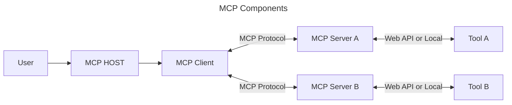

You need the concepts of MCP? With proper explanation and examples? Access to all resources? Just dive in!
<!-- more -->
## Why MCP? 
!!! note "MCP"
    MCP- Model Context Protocol

Let's see a simple table

| LLMs Can | But LLMs Can't |
| --- | --- |
| Generate a mail | Send a mail |
| Create a blog post or caption | Post it |
| Write code or sql query | Run it |
| Suggest a good book or meal | Place order for it |

You see, LLMs can't do a lot for you, but what it can't do is the real world task execution. No worries, we have a solution for that. It's called Tools :tools:. Tools are none but the executable real world tasks. Like API for sending email, a method to place order for book or your food. Now models can generate the task for you and use a suitable tool to execute it for you also. Ha ha, problem solved :smile:. But why MCP then? Here is why:

1. We don't a proper standard framework for tool building and execution. So everyone is the "Works best for me" approach to create tools.
2. Tools are being developed independently with no universal endorsements. It's a very common scenario when many are building same tools for the same purpose and since they are not shared we have duplications, re-inventing the wheel, creating change propagation problem.

MCP plays it's best game here. It's not a ground breaking technology but just a simple ptrotocol to acheive the following:

- Align developers on common standard for tool building and execution.
- Enhance compatibility and widespread adoption.

## What is MCP?
> A standard mechanism for AI systems to interact with external systems.

## MCP Architecture

=== "Traditional"
    ```mermaid
    ---
    title: Traditional
    ---
    flowchart TB
        A[User] --> B[Host]
        B --> A
        B[Host] --> C[Model]
        C --> B
    ```

=== "Agentic"
    ```mermaid
    ---
    title: Agentic
    ---
    flowchart TB
        A[User] --> B[Host]
        B --> A
        B[Host] --> C[Model]
        B --> D[[Tool]]
        B --> E[[Tool]]
        D --> B
        E --> B
    ```

=== "MCP"
    ```mermaid
    ---
    title: MCP
    ---
    flowchart TB
        A[User] --> B[Host]
        B --> A
        B[Host] --> C[Model]
        C --> B
        B[Host] --> D[MCP Client]
        D --> B
        subgraph MCP
        D[MCP Client] --> E[MCP Server A]
        D[MCP Client] --> F[MCP Server B]
        E & F --> D
        E --> G[[Tool]]
        F --> H[[Tool]]
        H --> F
        G --> E
        end
    ```
The subgraph in MCP is the actual protocol. There will be endless MCP servers that will serve different tools developed by developers maintaining standards. Others who need to access those tools can use them with MCP client. So now AI apps will just need to connect with the MCP Client and Boom! you can connect to any tools with few lines of JSON.

But two things to consider: Your host need to have support of MCP Client and the external services aka tools has a MCP Server.


## MCP Components


#### User
> The end user using the application

#### MCP Host
> Any Application that holds the MCP client. There can be other components and services in the application.

#### MCP Client
> A service that allows to communicate with MCP Servers.

#### MCP Protocol
> The protocol that actually maintain the communication between MCP Client and MCP Server.

=== "If Server in the same machine"
    If MCP Client and MCP server is in the same machine --> `STDIO` protocol. 
    !!! info "Process"
        The MCP host/client downloads the MCP Server on the local machine, installs it, runs it
        ```JSON title="MCP Server" linenums="1" hl_lines="3-9"
        {
            "mcpServers":{
                "airbnb":{
                    "command": "npx",
                    "args":[
                        "-y",
                        "@openbnb/mcp-server-airbnb"
                    ]
                }
            }
        }
        ```

=== "If Server in remote"
    If the server does not live in the local machine --> `HTTP` protocol. One vertual machine with one server and any number of client can be connected to it. All logic in the server. 
    !!! info "Process"
        User tells client where the MCP Server runs, MCP client pings the MCP Server through HTTP.
        ```JSON title="MCP Server" linenums="1" hl_lines="3"
        {
            "my-mcp-server-98356nk3":{
                "url": "http://127.0.0.1:98356nk3/mcp/"
            }
        }
        ```


#### MCP Server
> Connects to set of Tool, App, Processes

MCP Server mostly have tools, but it will also have resources and prompts. Tools are model controlled functions that can be invoked and does something. Resources are application controlled data (i.e User Profile database) that provide contextual data to the host (a get request). List of prompts that that user will choose instead fo their own created prompts.

#### MCP Tools
> An API or a local function or a process that serve some purpose. Each of the tool mostly introduced with a `name`, a `description` (what it does and what arguments are expected - can be a python docstring) and `input schema` (A dictionary of the arguments that the tool accepts).

!!! info "Example with components"
    __User Question__: Give me the weather of my current location.

    __MCP Host__: Weather App. Where you can see the weather and can ask about it. Weather App also knows that it has a MCP client and the client knows some tools (`user_profile_api`, `weather_api`) to get information. It also have a LLM model which have the complete context of the tools. With the user question the model will decide which tool to call. In this case first the `user_profile_api` to get user current location. Then the `weather_api` to get weather information of the location.

    __MCP Client__: MCP Client knows to call the `user_profile_api` and `weather_api` tool and also the arguments needed for each tool.

    __MCP Server__: MCP server have the tool `user_profile_api` as a local method to serve user profile including current location and tool `weather_api` which calls a weather API from weather API provider.

    __Response__: Response from MCP Server goes back to the MCP client, then back to LLM and represented to the user.

## Create a simple MCP Server

Here we will create a simple MCP server and make MCP client to run, connect and use it.
- __Host__: Claude Desktop App.
- __MCP Client__: Resides in claude desktop app.
- __Dependency Manager__: uv

!!! warning
    Make sure you have installed `python`, `uv`, `npm` or `npx` and any code editor.

Open up your editor and open the folder you what to use. Open the terminal. Initialize the project with `uv init`. It should create a hello world project. Then create a virtual machine with `uv venv`. It should create a `.venv` folder. Now activate the virtual environment with `.venv/bin/activate`. Now you need to add dependency `mcp`. You can use `uv`or `pip` whatever you like. I will add it with `uv add mcp[cli]`. That's it. Now create a python file to make a server. I will call it `weather.py`.
```bash title="File Structure"
.
├── helloworld
│   └── .venv
│   ├── weather.py
│   ├── main.py
│   ├── pyproject.toml
│   ├── README.md
│   └── uv.lock
        
```
=== "Server"

    ```python title="weather.py" linenums="1" hl_lines="1-3"
    from mcp.server.fastmcp import FastMCP

    mcp = FastMCP("Weather") #  (1)!

    @mcp.tool()
    def get_weather(location: str) -> str:
        """
        Get the current weather for a given location.

        Args:
            location (str): The location to get the weather for.

        Returns:
            str: The current weather information for the location.
        """
        # Simulate getting weather information
        return f"The current weather in {location} is sunny."

    if __name__ == "__main__":
        mcp.run()
    ```

    1. Create a server instance with a name.
=== "Tool"

    ```python title="weather.py" linenums="1" hl_lines="5-17"
    from mcp.server.fastmcp import FastMCP

    mcp = FastMCP("Weather") 

    @mcp.tool() # (1)!
    def get_weather(location: str) -> str: # (2)!
        """ # (3)!
        Get the current weather for a given location.

        Args:
            location (str): The location to get the weather for.

        Returns:
            str: The current weather information for the location.
        """
        # Simulate getting weather information
        return f"The current weather in {location} is sunny." # (4)!

    if __name__ == "__main__":
        mcp.run()
    ```

    1. Decorate the function with `@mcp.tool()` to make it a tool.
    2. Input and Output schema of the tool.
    3. Docstring explaining the tool. What it does and what arguments are expected and the return type.
    4. Return the result of the tool.

=== "Server initialization"

    ```python title="weather.py" linenums="1" hl_lines="19-20"
    from mcp.server.fastmcp import FastMCP

    mcp = FastMCP("Weather")

    @mcp.tool()
    def get_weather(location: str) -> str:
        """
        Get the current weather for a given location.

        Args:
            location (str): The location to get the weather for.

        Returns:
            str: The current weather information for the location.
        """
        # Simulate getting weather information
        return f"The current weather in {location} is sunny."

    if __name__ == "__main__":
        mcp.run() # (1)!
    ```

    1. Run the server.

### Running the Server as Developer Mode

Since you are creating the tools, and it might always need to run and be tested before it's published in production, `mcp` have OOB box feature to run a client that will host the mcp server with their tools. This is called __`MCP Inspector`__.It also give you promising UI to do the testing as easily as possible.

In the terminal run the command `#!bash mcp dev <file_name>`

After successful run you should get url like this: [http://localhost:6274](http://localhost:6274). Go ahead and explore the link. You will able to get all the necessary insights and testing tools there.


### Running it on Claude Desktop App

Open the Claude Desktop App. Go to `Setting` and then `Developer`section, and you will see `Local MCP Server`section and you will find `Edit Config` button. Click that, it will direct you to the `claude_desktop_config.json` file. Open that file in any editor and add configuration.
```json title="claude_desktop_config.json" linenums="1"
{
  "mcpServers": {
    "Weather": {
      "command": "C:\\Users\\<your_username>\\AppData\\Local\\Programs\\Python\\Python313\\Scripts\\uv.EXE",
      "args": [
        "run",
        "--with",
        "mcp[cli]",
        "mcp",
        "run",
        "absolute\\file\\path\\weather.py"
      ]
    }
  }
}
```
Don't worry, they are just simple command. We will go through them later. Now Close-and-Re-Open the Claude Desktop App. In the setting of the input field, you should see your MCP server listed.

### Creating your own Client

Now that we know how use out MCP server with Host App like Claude Desktop App, let's create our own Client. We will just create a new python file called `client.py` on the same folder as the server.

=== "Client"

    ```python title="client.py" linenums="1" hl_lines="7-8"
    from mcp import ClientSession, StdioServerParameters, types # (1)! 
    from mcp.client.stdio import stdio_client # (2)!
    import asyncio
    import traceback

    server_params = StdioServerParameters(
        command="uv", # (3)!
        args=["run", "weather.py"],
    )

    async def run():
        try:
            print("Starting client...")
            async with stdio_client(server_params) as (read, write): # (4)! Create a new client with the server parameters. 
                print("Client connected, creating session...")
                async with ClientSession(read, write) as session: # (5)! We then pass the read and write to a client session.
                    print("Initializing Session...")
                    await session.initialize() # (6)! Initialize the session.

                    print("Listing tools...")
                    tools = await session.list_tools() # (7)! List the tools.
                    print("Available tools:", tools)
                    
                    print("calling tool...")
                    result = await session.call_tool("get_weather", arguments={"location": "Sylhet"}) # (8)! Call the tool.
                    
                    print("Tool result:", result)
        except Exception as e:
            print("An error occurred:", e)
            traceback.print_exc()
        
    if __name__ == "__main__":
        asyncio.run(run()) # (9)! Run the client.
    ```

    1. Import the necessary modules for Client and Server Creation
    2. Import necessary modules for standard IO communication
    3. Command and args that need to turn up the MCP server.
    4. Create a new client with the server parameters.
    5. We then pass the read and write to a client session.
    6. Initialize the session. The client is now up and running and ready to go.
    7. We can get the list of tools available in the server.
    8. We can call the tools if we want.
    9. Run the client when the file is executed.

=== "File Strcture"
    ```bash title="File Structure"
    .
    ├── helloworld
    │   └── .venv
    │   ├── weather.py
    │   ├── client.py
    │   ├── main.py
    │   ├── pyproject.toml
    │   ├── README.md
    │   └── uv.lock
    ```
=== "Client but Remote Server"

    ```python title="client.py" linenums="1" hl_lines="7-8"
    from mcp import ClientSession, StdioServerParameters, types 
    from mcp.client.stdio import stdio_client
    import asyncio
    import traceback

    server_params = StdioServerParameters(
        command= "npx",
        args= [
            "-y",
            "@openbnb/mcp-server-airbnb",
            "--ignore-robots-txt"
        ]
    )

    async def run():
        try:
            print("Starting client...")
            async with stdio_client(server_params) as (read, write):
                print("Client connected, creating session...")
                async with ClientSession(read, write) as session:
                    print("Initializing Session...")
                    await session.initialize()

                    print("Listing tools...")
                    tools = await session.list_tools()

        except Exception as e:
            print("An error occurred:", e)
            traceback.print_exc()
        
    if __name__ == "__main__":
        asyncio.run(run())
    ```

    1. Only the command is going to changed here, and you can find those from the provider.

Now if we run the client with the command `#!bash uv run client.py` we will get:

```bash
Starting client...
Client connected, creating session...
Initializing Session...
Listing tools...
Available tools: meta=None nextCursor=None tools=[Tool(name='get_weather', title=None, description='\nGet the current weather for a given location.\n\nArgs:\n    location (str): The location to get the weather for.\n\nReturns:\n    str: The current weather information for the location.\n', inputSchema={'properties': {'location': {'title': 'Location', 'type': 'string'}}, 'required': ['location'], 'title': 'get_weatherArguments', 'type': 'object'}, outputSchema={'properties': {'result': {'title': 'Result', 'type': 'string'}}, 'required': ['result'], 'title': 'get_weatherOutput', 'type': 'object'}, icons=None, annotations=None, meta=None)]
calling tool...
Tool result: meta=None content=[TextContent(type='text', text='The current weather in Sylhet is sunny.', annotations=None, meta=None)] structuredContent={'result': 'The current weather in Sylhet is sunny.'} isError=False
```

We can see that the client is able to connect to the server and call the tool.

!!! tip "Local client with Remote Server"
    In case you want to connect with MCP Server in remote (airbnb for example) you just need the command to fire up the server and replace it with `server_params` command. That's it. Thats the power of MCP. See the code example in ___`Client but Remote Server`___ tab.

## More of MCP Server

### MCP Server with Local Resources Tool

!!! question "The problem"
    We have a local storage system (a `.txt` file for now :smile:). We want to build a MCP server that build two tools, one to read the resource and another to write on the resource. The LLMs will decide to chose which tool to use based upon user conversation.

```python title="localy.py" linenums="1"
from mcp.server.fastmcp import FastMCP

mcp = FastMCP("Local Keeper")


@mcp.tool()
def read_note() -> str:
    """
    Read my note stored in the local file.

    Returns:
        str: The content of the note.
    """
    try:
        with open("note.txt", "r") as file:
            return file.read()
    except FileNotFoundError:
        return "No note found."

@mcp.tool()
def write_note(content: str) -> str:
    """
    Write a note to a local file.

    Args:
        content (str): The content of the note to write.

    Returns:
        str: Confirmation message.
    """
    with open("note.txt", "a") as file:
        file.write(content + "\n")
    return "Note saved successfully."


if __name__ == "__main__":
    mcp.run()

```
Now we can check it with `mcp dev localy.py` and you will see the MCP Server running on the port ___6274___. Or can install it in Claude Desktop App with `mcp install localy` and use LLMs to verify. Go ahead, take the fame or blame if breaks :smile:.

### MCP Server with Local Action Tool

!!! question "The problem"
    We want to build a MCP sever that have the tool to take the screen shot and give it as a response. LLMs can make this tool call, get the screenshot as response and perform requested task based on the response.

```python title="screenshot.py" linenums="1"
from mcp.server.fastmcp import FastMCP
from mcp.server.fastmcp.utilities.types import Image

import pyautogui # (1)!
import io

# Create server
mcp = FastMCP("Screenshot Demo")

@mcp.tool()
def capture_screenshot() -> Image:
    """
    Capture the current screen and return the image. Use this tool whenever the user requests a screenshot of their activity.
    """

    buffer = io.BytesIO()

    # if the file exceeds ~1MB, it will be rejected by Claude
    screenshot = pyautogui.screenshot()
    screenshot.convert("RGB").save(buffer, format="JPEG", quality=60, optimize=True)
    return Image(data=buffer.getvalue(), format="jpeg")

if __name__ == "__main__":
    mcp.run()
```

1. Make sure you have installed `pyautogui` and `pillow` with `uv add pyautogui pillow`.
    
Well, run it, play with it and see the magic.

### MCP Server with API calling Tools

!!! question "The problem"
    We want to build a MCP server that have the tool to call an API and get the response. LLMs can make this tool call, get the response and perform requested task based on the response.

```python title="api.py" linenums="1"
from mcp.server.fastmcp import FastMCP
import requests

mcp = FastMCP("Crypto")

@mcp.tool()
def get_cryptocurrency_price(crypto: str) -> str:
    """
    Gets the price of a cryptocurrency.
    Args:
        crypto: symbol of the cryptocurrency (e.g., 'bitcoin', 'ethereum').
    """
    try:
        # Use CoinGecko API to fetch current price in USD
        url = f"https://api.coingecko.com/api/v3/simple/price"
        params = {"ids": crypto.lower(), "vs_currencies": "usd"}
        response = requests.get(url, params=params, timeout=10)
        response.raise_for_status()
        data = response.json()
        price = data.get(crypto.lower(), {}).get("usd")
        if price is not None:
            return f"The price of {crypto} is ${price} USD."
        else:
            return f"Price for {crypto} not found."
    except Exception as e:
        return f"Error fetching price for {crypto}: {e}"
    
if __name__ == "__main__":
    mcp.run()
```

### MCP Server with complex input Tool

!!! question "The problem"
    You have a business problem where you need a MCP Server with a tool that have to take complext input, like an object with 10 properties of different type. The tools need to make sure the that a parameters passed are ___valid___ and ___complete___ to work as expected. How can We do this?

Python have a killer library called `__Pydantic__` that helps us complex schema with ease. Let's solve our problem with that

```python title="complex.py" linenums="1"
from mcp.server.fastmcp import FastMCP
from pydantic import BaseModel, Field
from typing import List

# Create server
mcp = FastMCP("Other Inputs")

class Person(BaseModel):
    first_name: str = Field(..., description="The person's first name")
    last_name: str = Field(..., description="The person's last name")
    years_of_experience: int = Field(..., description="Number of years of experience")
    previous_addresses: List[str] = Field(default_factory=list, description="List of previous addresses")


@mcp.tool()
def add_person_to_member_database(person: Person) -> str:
    """
    Logs the personal details of the given person to the database.
    Args:
        person (Person): An instance of the Person class containing the following personal details:
            - first_name (str): The person's given name.
            - last_name (str): The person's family name.
            - years_of_experience (int): Number of years of experienceh.
            - previous_addresses (List[str]): A list of the person's previous residential addresses.

    Returns:
        str: A confirmation message indicating that the data has been logged.

    """

    with open("log.txt", "a", encoding="utf-8") as log_file:
        log_file.write(f"First Name: {person.first_name}\n")
        log_file.write(f"Last Name: {person.last_name}\n")
        log_file.write(f"Years of Experience: {person.years_of_experience}\n")
        log_file.write("Previous Addresses:\n")
        for idx, address in enumerate(person.previous_addresses, 1):
            log_file.write(f"  {idx}. {address}\n")
        log_file.write("\n")

    return "Data has been logged"

if __name__ == "__main__":
    mcp.run()
```
### MCP Server with Prompt

There will be cases where based on the user scenario the user have to choose the vest suitable prompt from a pre-build list of prompt. In enterprise level applications, it's a common practice to create, maintain and use different types of prompt on different use cases. User controls the selection of the prompt based on this need.

!!! Example "Example"
    Say, you need a prompt to make a plan for a trip, you need a separate prompt to automate the reservation and also a separate prompt to create and post a blog post about the trip.

    Experts will create separate prompt for each use cases, publish in MCP server, and If your client needs use that MCP server, It can easily let you choose the prompt based on your need. So ___an expert creates it ones and user (you and others who needs plan for vacation) can choose the prompt based on need___.

=== "Example 1"

    ```python title="prompt.py" linenums="1"
    from mcp.server.fastmcp import FastMCP

    mcp = FastMCP("Prompt")

    @mcp.prompt() # (1)!
    def get_prompt(topic: str) -> str: # (2)!
        """
        Returns a prompt that will do a detailed analysis on a topic
        Args:
            topic: the topic to do research on
        """
        return f"Do a detailed analysis on the following topic: {topic}"
    if __name__ == "__main__":
    mcp.run()

    ```

    1. Decorate the function with `@mcp.prompt()` to make it a prompt.
    2. The return type should always be a string.

=== "Example 2"

    ```python title="prompt.py" linenums="1"
    from mcp.server.fastmcp import FastMCP

    mcp = FastMCP("Prompt")

    @mcp.prompt()
    def write_detailed_historical_report(topic: str, number_of_paragraphs: int) -> str:
        """
        Writes a detailed historical report # (1)!
        Args:
            topic: the topic to do research on
            number_of_paragraphs: the number of paragraphs that the main body should be 
        """

        prompt = """
        Create a concise research report on the history of {topic}. 
        The report should contain 3 sections: INTRODUCTION, MAIN, and CONCLUSION.
        The MAIN section should be {number_of_paragraphs} paragraphs long. 
        Include a timeline of key events.
        The conclusion should be in bullet points format. 
        """

        prompt = prompt.format(topic=topic, number_of_paragraphs=number_of_paragraphs)

        return prompt
    if __name__ == "__main__":
    mcp.run()

    ```

    1. In case of model selecting the prompt, docstring plays a very important role.
You can run and deploy the MCP server as usual. But based on the Host you are using, it may differ how you will choose it.
```bash title="Output"

```

If you see the return type form the prompt, you can see that it's not just a string, an object with proper meta information.


### MCP Server with resource

If in case you have resources like, database, multimedia files, data files (csv, excel, etc.), you can make a MCP server that will serve those resources to the LLMs. That can be useful when you have resource that can be used by multiple client that are connected with the mcp server. Of course you can use tools to achieve same goal, but MCP server with resources is more efficient and easy to maintain.

!!! Example "Example"
    Say, you have a database of products and you want to use it in your MCP server. You can create a MCP server that will serve the database to the LLMs.

=== "Code Example 1"

    ```python title="resource.py" linenums="1"
    from mcp.server.fastmcp import FastMCP

    mcp = FastMCP("Resources")

    @mcp.resource("inventory://overview") # (1)!
    def get_inventory_overview() -> str:
        """
        Returns overview of inventory
        """
        # Sample inventory overview
        overview = """
        Inventory Overview:
        - Coffee
        - Tea
        - Cookies
        """
        return overview.strip() # (2)!

    if __name__ == "__main__":
    mcp.run()
    ```

    1. For resources the decorator is different, you need to use the unique `uri` to identify the resource.
    2. The returned Resource.

=== "Code Example 2"

    ```python title="resource.py" linenums="1"
    from mcp.server.fastmcp import FastMCP

    mcp = FastMCP("Resources")

    inventory_id_to_price = {
        "123": "6.99",
        "456": "17.99",
        "789": "84.99"
    }

    inventory_name_to_id = {
        "Coffee": "123",
        "Tea": "456",
        "Cookies": "789"
    }

    @mcp.resource("inventory://{inventory_id}/price") # (1)!
    def get_inventory_price_from_inventory_id(inventory_id: str) -> str:
        """
        Returns price from inventory id
        """
        return inventory_id_to_price[inventory_id]

    @mcp.resource("inventory://{inventory_name}/id")
    def get_inventory_id_from_inventory_name(inventory_name: str) -> str:
        """
        Returns id from inventory name
        """
        return inventory_name_to_id[inventory_name]

    if __name__ == "__main__":
    mcp.run()
    ```

    1. uri also have the capability to take dynamic value. Those values can be passed by the models to get the exact resources.

## Deploying and Publishing your MCP Server

It's not a useful tool that you created if it's not published and used by others with similar needs to solve similar problem. Here we will discuss the deployment and publishing process of MCP Servers. Decisions may vary based on the way you want to use, you may want to use it by downloading and running the server in local. Or you can deploy it in VM and access from there. We will try to describe both. But first you need to create and package an MCP Server. Since we already have created some, let's package it.

### Packaging MCP Server

Lets take a MSP server code base we already created above. Make sure you have the `pyproject.toml` file in the root of the project, and also move the mcs server code files to a `src` -> `mcpserver` folder. And also a `__init__.py` and `__main__.py` file to the `mcpserver` folder.

```bash title="File Structure"
.
├── src
│   ├── mcpserver
│   │   ├── __init__.py
│   │   ├── __main__.py
│   │   ├── resource.py
│   │   ├── prompt.py
│   │   ├── api.py
│   │   ├── complex.py
│   │   └── screenshot.py
├── pyproject.toml
├── README.md
├── uv.lock

```
Now we need a `entrypoint` to the server. We will create that with `__main__.py` file. WE also need to add some configurations to the `pyproject.toml` file.

=== "Entrypoint"
    ```python title="__main__.py" linenums="1"
    from mcpserver.server import mcp

    def main():
        mcp.run()
     
    if __name__ == "__main__":
    main()
    ```
=== "Configs"
    ```toml title="pyproject.toml" linenums="1"
    [project]
    name = "<project_name>"
    version = "0.1.0"
    description = "Add your description here"
    readme = "README.md"
    requires-python = ">=3.13"
    dependencies = [
        ...
    ]

    [project.scripts]
    mcp-server = "mcpserver.__main__:main" # (1)!

    [buid-system]
    requires = ["setuptools"]
    build-backend = "setuptools.build_meta"

    [tool.setuptools]
    package-dir={""="src"}

    [tool.setuptools.packages.find]
    where = ["src"]
    ```

    1. When we will run command `run mcp-server`, this will run the main function of the `__main__.py` file. Also the dependencies will be also installed. 

We will try to package it now and use github to host it for us. Make sure to make a repo, commit and push the changes. Done! The cofig file that can be used to download and install you server can be:
```json title="mcp_config.json" linenums="1"
{
    "mcpServers": {
        "<project_name>": {
            "command": "uvx",
            "args": ["--from", "git+<repo_url>", "mcp-server"]
        }
    }
}
```
## MCP Server with Streamable HTTP

The main goal is to user the MCP server by the MCP Client, when MCP Server is running in one machine and MCP server is running on another machine.

We will consider a simple example. We will have a simple MCP server with only on tool to greet a name, if you pass a name to it. 

```python title="greet.py" linenums="1"
from mcp.server.fastmcp import FastMCP

mcp = FastMCP("Streamable", port=8002) # (1)!

@mcp.tool() 
def greeting(name: str) -> str:
    """Generate a greeting message."""
    return f"Hello, {name}!"


if __name__ == "__main__":
    mcp.run(transport="streamable-http") # (2)!

```

1. The server is running on the port 8002. If you need to run on different `host` and different `port` you need to specify here.
2. To make you MCP server 

There are two things we need to know now. Run the server and the client separately. Let's run both of them in local but separately. To run the server we will use `uv run greet.py` command to one terminal and to run the inspection mode (client) we will use `mcp dev greet.py` in another terminal. 

Once the both are up, you can go to the inspector and add the following configuration:
1. __Transport Type__: Streamable HTTP
2. __URL__: `http://localhost:8002/mcp`

You can check and inspect the tools now. Event if your Server is deployed in a remote address like `https://your-server.com` you can still use it with the same configuration, where the URL would be `https://your-server.com/mcp`.

!!! warning "Important"
    Please note that, you need to add the `/mcp` at the end of the URL. Otherwise it will not work.

!!! Note "Note"
    In Claude Desktop App, you can not use the Streamable HTTP transport type. But you can use a `npm`package `mcp-remote` to use the MCP server in remote.
    The server configuration will be:
    ```json title="mcp_config.json" linenums="1"
    {
        "mcpServers": {
            "<project_name>": {
                "command": "npx",
                "args": ["mcp-remote", // (1)!
                        "https://your-server.com/mcp/", // (2)!
                        "--allow-http"
                    ]
            }
        }
    }
    ```

    1. `mcp-remote` is the npm package
    2. The address where your MCP server is running.

### Testing streamable HTTP MCP Server with VS Code

If you have Copilot in VS code, you can test the Streamable HTTP MCP Server with it.
1. create a `.vscode` folder.
2. Inside the folder create a `mcp.json` file.
3. Add the following config in the file.
```json title="mcp.json" linenums="1"
{
    "servers": {
        "<unique_name></unique_name>": {
            "url": "<mcp_server_url>/mcp"
        }
    }
}
```
With this you will now be able to check the Streamable HTTP Server in VS Code Copilot Chat window.

## MCP Client

!!! info "MCP Client"
    It's the client that communicate with MCP Server for you

To create a client the main power tool we will be using is `ClientSession` class. The class is going to take the details of the MCP Server and Create session with it. Then you need the initialize the session. After that you can ___ping___, ___list tools___, ___list resources___, ___list prompts___ and ___call tools___ with the session.

### JSON RPC

!!! info "JSON RPC"
    A JSON Communication protocol where the requests have the following items:
    1. `id`: A unique identifier for the request.
    2. "jsonrpc": The version of the JSON RPC protocol.
    3. "method": The method to call or the function to invoke.
    4. "params": The parameters to pass to the method.
    ```json title="json_rpc.json" linenums="1"
    {
        "id": 1,
        "jsonrpc": "2.0",
        "method": "ping",
        "params": {} # (1)!
    }
    ```
    1. The parameters to pass to the method.

    And the response will have the following items:
    1. `id`: A unique identifier for the request.
    2. "jsonrpc": The version of the JSON RPC protocol.
    3. "result": The result of the method call. It can be a valid json content.
    4. "error": The error message if the method call fails. {code, message, data}
    ```json title="json_rpc.json" linenums="1"
    {
        "id": 1,
        "jsonrpc": "2.0",
        "result": <a_valid_jason_content>,
        "error": null
    }
    ```

### MCP Client examples
Let's create a simple client to test the MCP Server.

=== "Client Creation"
    ```python title="client.py" linenums="1"
    from mcp import ClientSession, StdioServerParameters, types
    from mcp.client.stdio import stdio_client
    import asyncio
    import traceback

    server_params = StdioServerParameters(
        command="uv",
        args=["--directory", "C:<path_to_server>", "run", "server.py"],  # Optional command line arguments
    )

    async def run():
        try:
            print("Starting stdio_client...")
            async with stdio_client(server_params) as (read, write):
                print("Client connected, creating session...")
                async with ClientSession(read, write) as session:
                    ...
        except Exception as e:
            print("An error occurred:")
            traceback.print_exc()

    if __name__ == "__main__":
        asyncio.run(run())

    ```
=== "Get Tools and Call Tool"
    ```python title="client.py" linenums="1"
    from mcp import ClientSession, StdioServerParameters, types
    from mcp.client.stdio import stdio_client
    import asyncio
    import traceback

    server_params = StdioServerParameters(
        command="uv",
        args=["--directory", "C:<path_to_server>", "run", "server.py"],  # Optional command line arguments
    )

    async def run():
        try:
            async with stdio_client(server_params) as (read, write):
                async with ClientSession(read, write) as session:
                    await session.initialize()

                    # TOOLS

                    print("Listing tools...")
                    tools = await session.list_tools()
                    print("Available tools:", tools)

                    print("Calling tool...")
                    result = await session.call_tool("get_weather", arguments={"location": "San Francisco"})
                    print("Tool result:", result)

        except Exception as e:
            print("An error occurred:")
            traceback.print_exc()

    if __name__ == "__main__":
        asyncio.run(run())

    ```
=== "Read and Use Resources"
    ```python title="client.py" linenums="1"
    from mcp import ClientSession, StdioServerParameters, types
    from mcp.client.stdio import stdio_client
    import asyncio
    import traceback

    server_params = StdioServerParameters(
        command="uv",
        args=["--directory", "C:<path_to_server>", "run", "server.py"],  # Optional command line arguments
    )

    async def run():
        try:
            async with stdio_client(server_params) as (read, write):
                async with ClientSession(read, write) as session:

                    # RESOURCES

                    print("Listing resources...")
                    resources = await session.list_resources()
                    print("Available resources:", resources)

                    print("Listing resources templates...")
                    resources = await session.list_resource_templates()
                    print("Available resource templates:", resources)

                    print("Getting resource")
                    resource = await session.read_resource("weather://statement")
                    print(resource)

                    print("Getting resource template")
                    resource = await session.read_resource("weather://Sylhet/statement")
                    print(resource)

        except Exception as e:
            print("An error occurred:")
            traceback.print_exc()

    if __name__ == "__main__":
        asyncio.run(run())

    ```
=== "Use Prompts"
    ```python title="client.py" linenums="1"
    from mcp import ClientSession, StdioServerParameters, types
    from mcp.client.stdio import stdio_client
    import asyncio
    import traceback

    server_params = StdioServerParameters(
        command="uv",
        args=["--directory", "C:<path_to_server>", "run", "server.py"],  # Optional command line arguments
    )

    async def run():
        try:
            async with stdio_client(server_params) as (read, write):
                async with ClientSession(read, write) as session:
                    await session.initialize()

                    # PROMPTS
                    print("Listing prompts...")
                    prompts = await session.list_prompts()
                    print("Available prompts templates:", prompts)

                    print("Prompt tool...")
                    result = await session.get_prompt("get_prompt", arguments={"topic": "Water Cycle"})
                    print("Prompt result:", result)

        except Exception as e:
            print("An error occurred:")
            traceback.print_exc()

    if __name__ == "__main__":
        asyncio.run(run())

    ```
=== "The Server"
    ```python title="server.py" linenums="1"
    from mcp.server.fastmcp import FastMCP

    mcp = FastMCP("Weather")

    @mcp.tool()
    def get_weather(location: str) -> str:
        """
        Gets the weather given a location
        Args:
            location: location, can be city, country, state, etc.
        """
        return f"The weather in {location} is hot and dry"

    @mcp.resource("weather://statement")
    def get_weather_statement() -> str:
        """
        Returns the weather statement
        """
        return "This is an example weather statement"

    @mcp.resource("weather://{city}/statement")
    def get_weather_statement_from_city(city: str) -> str:
        """
        Returns the weather statement based on a particular city
        """
        return f"No special statements for this city: {city}"

    @mcp.prompt()
    def get_prompt(topic: str) -> str:
        """
        Returns a prompt related to asking for more information on weather concepts about {topic}
        Args:
            topic: the topic to do research on
        """
        return f"Describe the weather concept of {topic}"


    if __name__ == "__main__":
    mcp.run()
    ```
You can also create the tool call, resource calls and the prompt calls with LLMs and Users.


## Example Projects

### MCP Server to build Memory

Check out the Files. You should already know how the file are structured.

=== "MCP Server"
    ```python title="server.py" linenums="1"
    from mcp.server.fastmcp import FastMCP
    from openai import OpenAI
    import tempfile
    from dotenv import load_dotenv
    import os

    # Load environment variables from a .env file if present
    load_dotenv()

    client = OpenAI()

    VECTOR_STORE_NAME = "MEMORIES"

    mcp = FastMCP('Memories')

    def get_or_create_vector_store():
        # Try to find existing vector store, else create
        stores = client.vector_stores.list()
        for store in stores:
            if store.name == VECTOR_STORE_NAME:
                return store
        return client.vector_stores.create(name=VECTOR_STORE_NAME)


    @mcp.tool()
    def save_memory(memory: str):
        """Save a memory string to the vector store."""
        vector_store = get_or_create_vector_store()
        # Save memory to a temp file for upload
        with tempfile.NamedTemporaryFile(mode="w+", delete=False, suffix=".txt") as f:
            f.write(memory)
            f.flush()
            client.vector_stores.files.upload_and_poll(
                vector_store_id=vector_store.id,
                file=open(f.name, "rb")
            )
        return {"status": "saved", "vector_store_id": vector_store.id}


    @mcp.tool()
    def search_memory(query: str):
        """Search memories in the vector store and return relevant chunks."""
        vector_store = get_or_create_vector_store()
        results = client.vector_stores.search(
            vector_store_id=vector_store.id,
            query=query,
        )

        content_texts = [
            content.text
            for item in results.data
            for content in item.content
            if content.type == "text"
        ]

        return {"results": content_texts}


    if __name__ == "__main__":
    mcp.run(transport="stdio")
    ```

=== "Credentials"
    ```python title=".env" linenums="1"
    OPENAI_API_KEY=<your_openai_api_key>
    ```

